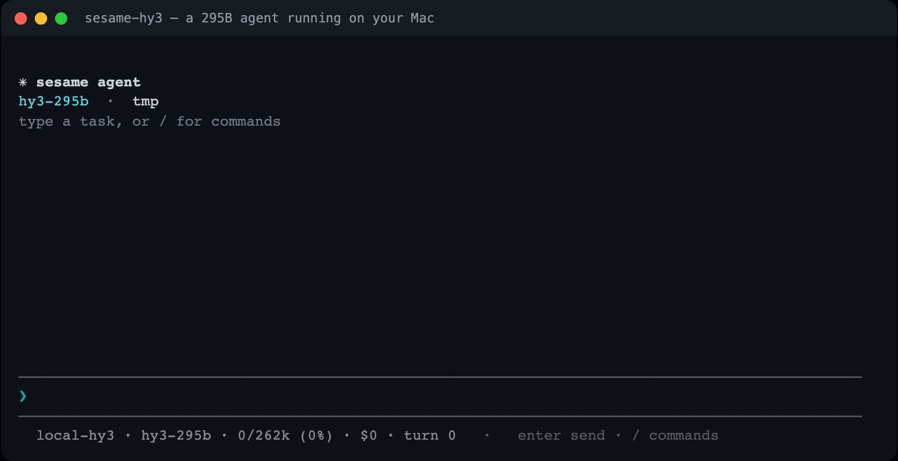

# sesame-hy3

Run a 295-billion-parameter model on your own Mac, with a full agent driving it.
No API key, no cloud, nothing leaves the machine.



This packages two things together: [sesame](https://github.com/vcup-date/sesame-agent),
a terminal and browser agent, and **Hy3** (Tencent HunYuan v3, 295B total / 21B
active), running locally through a patched llama.cpp. It is set up specifically
for an **Apple Silicon Mac with 128 GB** of memory, where the model fits at its
full **256k-token context**.

## What you need

- An **Apple Silicon Mac (M-series) with 128 GB** of unified memory. Less than
  that and the model still runs, but at a smaller context window.
- About **90 GB of free disk** for the model.
- A one-time setup that builds the engine and downloads the model.

## Get it running

```bash
git clone https://github.com/vcup-date/sesame-hy3
cd sesame-hy3
./start.sh
```

Or, without a terminal: open the folder in Finder and double-click
**Start Sesame Hy3.command**.

The first run does the one-time setup on its own:

1. builds the hy_v3-patched llama.cpp (10-20 minutes),
2. downloads the model, 85 GB (once),
3. sets up the agent.

After that, `./start.sh` brings the model up and drops you into the agent in
under a minute. For the browser interface instead of the terminal, use
`./start-web.sh` (or **Start Sesame Hy3.command** then type `web`), which opens
`http://127.0.0.1:9981`.

Stop the model server (it holds ~92 GB while running) with `./stop.sh`.

## About the 256k context

macOS reserves part of unified memory for the system and caps how much the GPU
may hold, defaulting to about 107.5 GB. The model's weights (85.5 GB) plus a
256k-token KV cache (22.8 GB) need about 112 GB, just over that cap. So `start.sh`
raises the cap to 120 GB for you, with a single password prompt. It is temporary
and resets when you reboot; nothing is changed permanently.

If you skip the password, it falls back to the largest context that fits at the
default cap (around 192k) and still runs.

Decode speed is about **31 tokens/second**, and it does not change with context
length, so a 256k session runs at the same speed as a short one.

## What the agent can do

Read and edit files, run shell commands, search the web, drive a real browser,
and show its reasoning as it works. It asks before anything it cannot take back
(`rm -rf`, overwriting a file, and so on), and any turn can be undone. Sessions
are saved and resumable. Full details are in the
[sesame README](https://github.com/vcup-date/sesame-agent).

## Notes

- **Quality vs. context.** This uses the 1-bit `IQ1_M` quant, which is what makes
  256k fit in 128 GB. It is a heavy compression; for higher answer quality at the
  cost of context, the same repo (`AngelSlim/Hy3-GGUF`) has `Hy3-Q4_K_M-mtp.gguf`,
  which will not reach 256k on 128 GB.
- **Speculative decoding is off.** On a mixture-of-experts model this size it is
  slower, not faster, because verifying draft tokens activates the union of their
  experts. Measured here at 21 tok/s with it on versus 31 with it off.
- **Reuse what you have.** If the model or the built engine already exist on your
  machine, setup links to them instead of downloading or rebuilding. Point it
  with `HY3_MODEL=/path/to.gguf` or `HY3_ENGINE=/path/to/llama-server`.

## Layout

```
start.sh           bring the model up and launch the agent (terminal)
start-web.sh       same, but the browser interface
stop.sh            stop the model server
setup.sh           one-time build + download (start.sh calls it if needed)
engine/            the patches that add hy_v3 support to llama.cpp (built by setup)
sesame/            the agent
models/            the downloaded model (gitignored)
```

Hy3 is Tencent's HunYuan v3; the GGUF and llama.cpp patches are AngelSlim's. sesame
and this launcher are MIT licensed.
